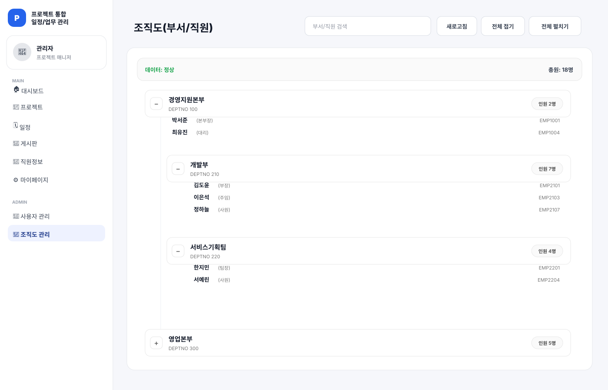

# undefined

> 프로젝트·업무·일정·조직 정보를 통합 관리하는 사내 협업 시스템

## 프로젝트 소개

undefined는 조직 구성원이 프로젝트 진행 상황과 개인 업무를 한 화면에서 확인하고, 일정·문서·보고·게시판을 함께 관리할 수 있도록 만든 Java 기반 웹 애플리케이션입니다. 프로젝트 구성원과 권한, 업무 상태 이력, 부서 구조까지 연결해 실제 조직 업무 흐름을 모델링했습니다.

## 핵심 기능

- **대시보드:** 프로젝트·업무·일정 현황 요약
- **프로젝트 관리:** 프로젝트 생성, 멤버 초대·권한 변경, 설정 관리
- **업무 관리:** 업무 등록·수정·담당자 지정, 상태 변경 이력, 이슈 관리
- **일정 관리:** 개인·프로젝트 캘린더와 Google Calendar API 연동
- **협업 문서:** 프로젝트 문서, 보고서 작성·목록·상세 조회
- **게시판:** 게시글·댓글·첨부파일 CRUD
- **조직 관리:** 부서 트리, 임직원 조회, 관리자용 사용자 생성·수정
- **알림:** 업무와 프로젝트 활동 기반 알림

## 담당 구현

- 기존 DTO·DAO·Service·Mapper 계층을 활용한 관리자 조직도 화면 구현
- `/admin/departments/tree?includeUsers=true` API와 계층형 부서·직원 데이터 연결
- 부서별 인원과 전체 인원을 중복 없이 집계
- 부서·직원 검색, 개별 접기·펼치기, 전체 접기·펼치기 기능

## 담당 화면

원본 JSP·CSS·JavaScript 구조를 기준으로 포트폴리오용 대표 데이터를 표시했습니다.

## 시스템 구조

~~~mermaid
flowchart LR
    A[Browser] --> B[Spring MVC Controller]
    B --> C[Service]
    C --> D[DAO / MyBatis]
    D --> E[(Oracle DB)]
    C --> F[Google Calendar API]
    B --> G[JSP Views]
~~~

## 기술 스택

| 영역 | 기술 |
|---|---|
| Language | Java 11, JavaScript |
| Backend | Spring MVC 5.3, Servlet/JSP, JSTL |
| Persistence | MyBatis, Spring JDBC, Apache DBCP2 |
| Database | Oracle |
| External API | Google Calendar API, Google OAuth |
| Build | Maven, WAR |
| Logging | Log4j2 |
| Data | Jackson, json-simple |

## 주요 도메인

| 도메인 | 내용 |
|---|---|
| Project | 프로젝트 정보와 멤버 관리 |
| Task / Issue | 업무·이슈·담당자·상태 이력 |
| CalendarEvent | 일정 관리 및 외부 캘린더 연동 |
| Report / Attachment | 보고서와 첨부파일 |
| Board / Comment | 사내 게시판과 댓글 |
| Department / Role | 조직도와 사용자 권한 |
| Notification | 활동 알림 |

## 폴더 구조

~~~text
undefined/
└── Project/
    ├── pom.xml
    └── src/main/
        ├── java/com/app/
        │   ├── controller/
        │   ├── service/
        │   ├── dao/
        │   └── dto/
        └── webapp/
            └── WEB-INF/
                ├── mybatis/mapper/
                ├── views/
                └── sql/
~~~

## 실행 환경

- JDK 11
- Maven
- Oracle Database
- Java Servlet 4 호환 서버(Tomcat 9 등)

## 빌드 방법

~~~bash
git clone https://github.com/Eung-Seok/undefined.git
cd undefined/Project
mvn clean package
~~~

생성된 WAR 파일을 Servlet 컨테이너에 배포합니다. 실행 전 Oracle 연결 정보와 Google Calendar OAuth 설정이 필요합니다.

## 프로젝트 포인트

- Controller–Service–DAO 계층과 MyBatis Mapper를 분리해 기능별 책임을 명확히 했습니다.
- 프로젝트, 업무, 조직, 권한 데이터를 연결해 협업 서비스의 복합 도메인을 구현했습니다.
- 내부 일정과 Google Calendar를 연동할 수 있도록 외부 API 통합 구조를 구성했습니다.
